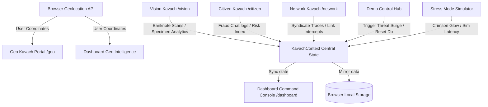

# 🛡️ Kavach AI: Command-Center Cyber Intelligence & Fraud Detection Hub

Kavach AI is a next-generation command-center cyber intelligence portal designed for law enforcement agencies, cyber cells, and citizens. Built using **Next.js**, **React 19**, and **TailwindCSS/PostCSS v4**, the application coordinates threat assessment, dynamic syndicate graph analysis, geospatial mapping, and automated counterfeit currency verification into a single unified workspace.

---

## 🏗️ System Architecture & Data Flow

Kavach AI is designed with a decentralized portal layout that feeds real-time telemetry back into a centralized, reactive state manager.



### Key Architectural Layers:
1. **Centralized Data Backbone (`KavachContext`)**:
   - Integrates state coordination across all independent portals.
   - Synchronizes incident counters, recent scans, threat maps, and dispatch tables.
   - Implements **Local Storage Mirroring** to ensure scan results and chat threat ratings persist across Next.js page transitions and server updates.
2. **Dynamic Geolocation Engine**:
   - Requests browser coordinates on mount for the dashboard and the `/geo` portal.
   - Contacts OpenStreetMap's Nominatim API to resolve the user's city and state dynamically.
   - Appends a customized `"Local Outpost Node"` profile centered on the user's physical region.
3. **AI Banknote Verification Proxy**:
   - Secure server-side endpoint (`/api/detect`) proxies images to the Groq API utilizing `meta-llama/llama-4-scout-17b-16e-instruct` or fallback vision models.
   - Incorporates a local image heuristics engine utilizing HTML5 Canvas to calculate pixel aspect ratios, tactile luminance deviations, digital overlays, and portrait structure indices.

---

## 🚦 Core Portals & Capabilities

### 1. 🖥️ Dashboard Console (`/dashboard`)
The central command desk displaying live telemetry feeds, incident stream registries, threat distribution indicators, and coordinate feeds.
* **Demo Control Hub**: Provides actions to trigger threat surges (inserting mock alerts into the pipeline) or reset the client-side database.
* **System Stress Simulator**: Simulates degraded network conditions. Enabling stress mode triggers a global warning banner, shifts background lighting to a pulsing crimson hue, and doubles the loading delays of scanners while outputting connection retry logs.

### 2. 🔍 Vision Kavach banknote verifier (`/vision`)
A high-fidelity currency inspection scanner.
* Supports **Drag-and-Drop** file uploaders and interactive specimen select boxes.
* Evaluates banknote dimensions, Swachh Bharat layout coordinates, intaglio bleed marks, watermark regions, and tactile contrast.
* Renders bounding-box overlays over Gandhi portrait watermarks and security threads with diagnostic console logs.

### 3. 💬 Citizen Kavach safety companion (`/citizen`)
An AI chatbot enabling citizens to paste suspicious messages, links, or phone calls for threat evaluations.
* **Linguistic Threat Engine**: Inspects input texts for coercion patterns and digital arrest claims. Renders interactive radial risk indicators.
* **Multilingual Translation Layer**: Complete workspace localization supporting **English**, **Hindi**, and **Gujarati**.

### 4. 🕸️ Network Kavach syndicate inspector (`/network`)
An interactive, canvas-based node-relationship visualizer built with `@xyflow/react`.
* Traces relationship maps connecting victim endpoints, burner phones, fake bank accounts, and spoof gateways.
* Clusters coordinates across major high-risk zones (Jamtara, Mewat, Delhi).
* Sidebar detail pane displays coordination logs, node count density, and threat severity rating.

### 5. 🗺️ Geo Kavach mapping portal (`/geo`)
A geospatial dashboard utilizing dark-themed **Leaflet.js** tiles.
* Plots threat zones and seizures across major national hubs (Delhi, Mumbai, Bengaluru, Surat).
* Auto-detects the browser coordinates of the operator, panning the map directly over their local neighborhood with a zoomed-in active Outpost beacon.

---

## 🛠️ Installation & Local Development

### Prerequisites:
* **Node.js** (v18.0.0 or higher recommended)
* **npm** or **yarn**

### 1. Clone & Install Dependencies:
```bash
# Navigate to the workspace directory
cd "Kavach AI"

# Install package dependencies
npm install
```

### 2. Configure Environment Variables:
Create a `.env.local` file in the root directory and define the Groq API key:
```env
GROQ_API_KEY=your_groq_api_key_here
```

### 3. Run the Development Server:
```bash
npm run dev
```
Open [http://localhost:3000](http://localhost:3000) inside your web browser.

### 4. Build for Production:
```bash
# Check TypeScript and compile static Next.js assets
npm run build

# Start the compiled production bundle locally
npm run start
```

---

## 🎨 Visual Design System

Kavach AI features a curated, dark glassmorphic visual system built with **TailwindCSS**:
* **Theme**: Deep zinc background (`bg-zinc-950`) combined with slate-indigo and neon violet highlights.
* **Component System**: Glassmorphic custom cards (`border border-zinc-900 bg-zinc-900/10 backdrop-blur`).
* **Animations**: Powered by **Framer Motion** for smooth page transitions, sidebar shifts, dynamic layout entries, and typing indications.
* **Map Design**: Custom Leaflet dark overrides to replace standard Leaflet popup templates with dark command panels.
